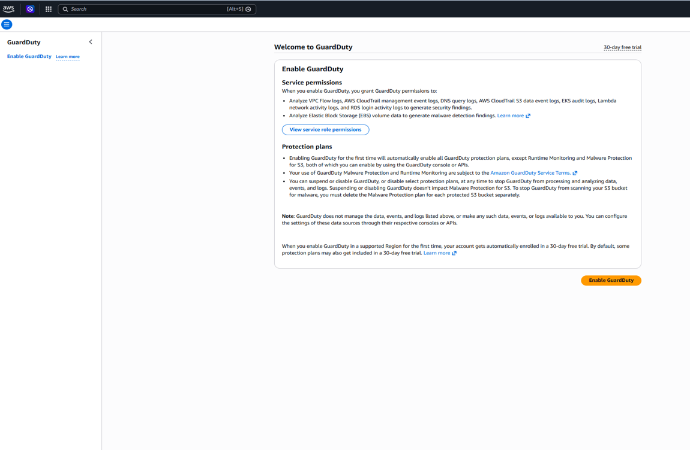
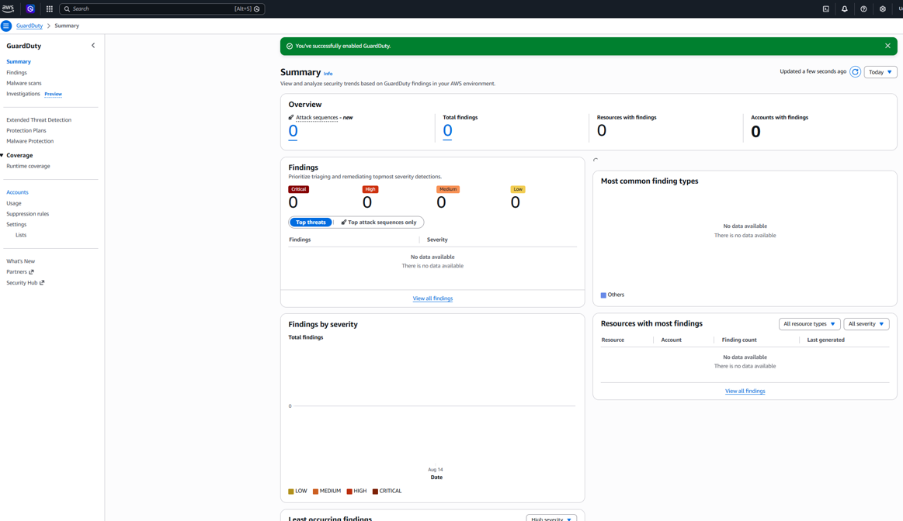
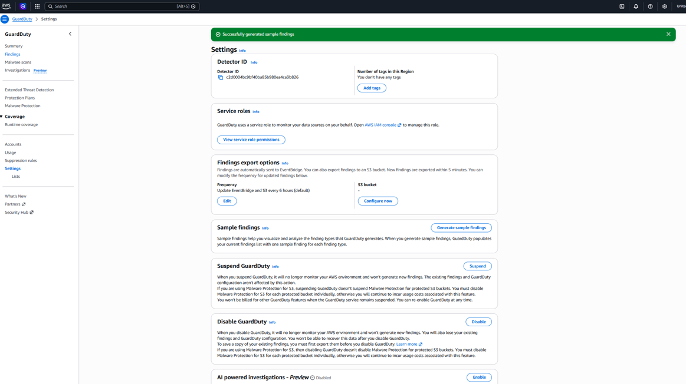
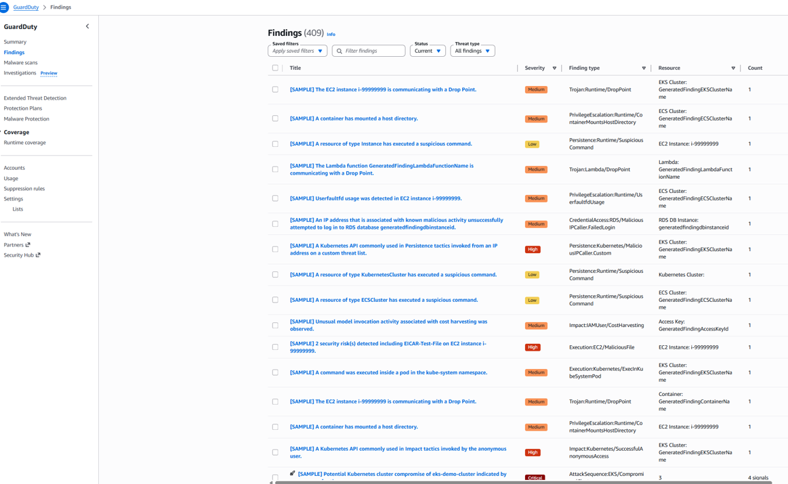
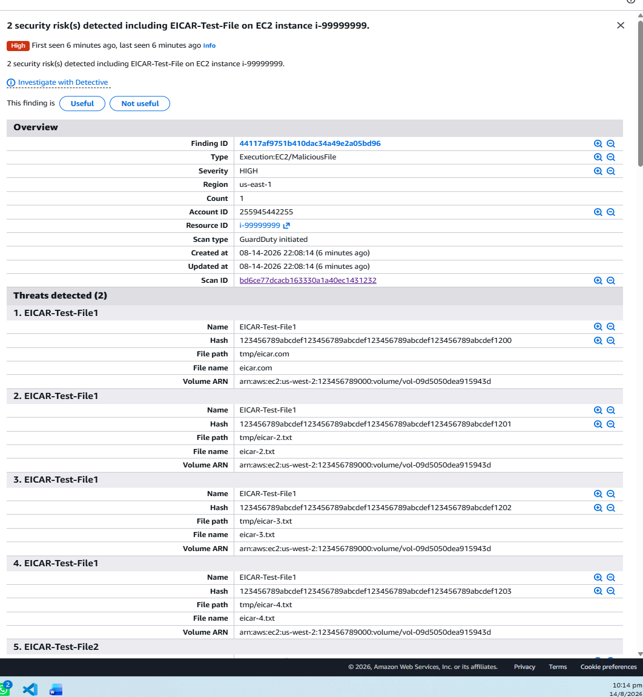

# Amazon GuardDuty Mini Project

## Overview
This mini project demonstrates how Amazon GuardDuty can be used to detect and review potential security threats in an AWS environment.

Amazon GuardDuty is a managed threat detection service that continuously monitors AWS accounts and workloads for suspicious or malicious activity.

## How Amazon GuardDuty Works

Amazon GuardDuty continuously monitors and analyses activity within an AWS environment to identify suspicious or potentially malicious behaviour.

GuardDuty analyses foundational data sources such as:

- AWS CloudTrail management events – monitors API and account activity
- VPC Flow Logs – analyses network traffic patterns
- DNS logs – identifies suspicious domain requests

GuardDuty uses threat intelligence, machine learning and behavioural analysis to identify potential threats.

When suspicious activity is detected, GuardDuty generates a **finding** containing information such as:

- Finding type
- Severity level
- Affected AWS resource
- Details about the detected threat

This helps security teams prioritise findings and investigate potential security incidents.

## Demo Objective
The objective of this demonstration is to:

- Enable Amazon GuardDuty
- Generate AWS sample findings
- Review the different security findings and severity levels
- Analyse a High severity finding

## Demo Steps

### 1. Enable Amazon GuardDuty
Amazon GuardDuty was enabled in the **us-east-1 (N. Virginia)** region.

### 2. Generate Sample Findings
Sample findings were generated using the built-in **Generate sample findings** option in GuardDuty.

These findings are provided by AWS for testing and demonstration purposes and do not represent real security incidents.

### 3. Review GuardDuty Findings
After generating the samples, GuardDuty displayed findings with different severity levels:

- Low
- Medium
- High
- Critical

### 4. Analyse a High Severity Finding
For this demonstration, the following sample finding was reviewed:

**Finding:** EICAR-Test-File detected on an EC2 instance (AWS sample finding)

**Finding Type:** `Execution:EC2/MaliciousFile`

**Severity:** High

GuardDuty provided information about the affected resource, detected threat and malware scan details.

## GuardDuty Detection Flow

AWS Activity → GuardDuty Analysis → Threat Detection → Security Finding → Investigation

## Key Learning
Amazon GuardDuty helps security and cloud teams identify suspicious activity without manually reviewing large amounts of AWS activity data.

The findings provide useful information such as severity, finding type and affected resources, which can help security teams decide what needs further investigation.

## Note
All findings shown in this project are AWS-generated sample findings for demonstration purposes. No real malicious activity was performed.

## References

The following official AWS documentation was used as references for this mini project:

- [What is Amazon GuardDuty?](https://docs.aws.amazon.com/guardduty/latest/ug/what-is-guardduty.html)
- [Getting started with Amazon GuardDuty](https://docs.aws.amazon.com/guardduty/latest/ug/guardduty_settingup.html)
- [Understanding and generating Amazon GuardDuty findings](https://docs.aws.amazon.com/guardduty/latest/ug/guardduty_findings.html)
